# Homelab Server Configuration

Welcome to my Homelab server! This document provides an overview of the configuration and specifications of my Intel NUC i7-1360P machine running Proxmox. This repository includes comprehensive reverse proxy configurations supporting both nginx/SWAG and Caddy solutions. Let's dive into the details!

## Hardware Specifications

- **Processor:** Intel Core i7-1360P
- **Memory:** 64GB
- **Passmark:** 19726
- **TDP:** 28 W
- **Storage:** 24TB HDD + 2TB SSD M.2 NVME
- **RAID Configuration:** RAID 1 using ZFS
- **Total Storage Capacity:** 26TB

## Software Configuration

- **Operating System:** Proxmox
- **Virtualization Platform:** Proxmox VE
- **Container Technology:** LXC (Linux Containers)
- **Virtual Machine Technology:** QEMU/KVM

## Reverse Proxy Solution

### SWAG (LinuxServer.io)

- **Location:** `SWAG-reverse-proxy/`
- **Status:** Currently deployed
- **Features:** nginx-based, automatic SSL, fail2ban
- **Configurations:** Auto-generated subdomain configs for all services

## Service Architecture

**Total Services:** 37 configured services including:

- Media services (Plex, Jellyfin, Immich)
- Automation tools (\*arr stack, Home Assistant)
- Development tools (AI/ML, databases)
- Monitoring and security (Grafana, CrowdSec)
- Productivity apps (Nextcloud, Vaultwarden)

## Homelab Setup

- **Purpose:** Media server, personal NAS, personal experimental Homelab
- **Network Configuration:** 2.5GBe LAN connection with [GL.Inet Flint2](https://www.gl-inet.com/products/gl-mt6000/) and Caldigit TS4 Elements Hub using 1 Thunderbolt 4 port
- **Services and Applications:** [Services](machines)

# Homelab Architecture

## System Architecture Diagram

```mermaid
graph TB
    subgraph "Proxmox Host"
        PVE["Proxmox VE<br/>Hypervisor"]
        LXC["LXC Containers"]
        VM["QEMU/KVM VMs"]
    end

    subgraph "Reverse Proxy Layer"
        SWAG["SWAG nginx<br/>LinuxServer.io<br/>Auto SSL<br/>fail2ban"]
        CF["Cloudflare DNS<br/>Domain Management"]
    end

    subgraph "Media Services"
        Plex["Plex Media Server<br/>plex.piyushmehta.com"]
        Jellyfin["Jellyfin<br/>jellyfin.piyushmehta.com"]
        Immich["Immich Photos<br/>photos.piyushmehta.com"]
        Navidrome["Navidrome Music<br/>music.piyushmehta.com"]
    end

    subgraph "Automation Stack"
        Overseerr["Overseerr<br/>request.piyushmehta.com"]
        Radarr["Radarr Movies<br/>radar.piyushmehta.com"]
        Sonarr["Sonarr TV<br/>sonarr.piyushmehta.com"]
        Prowlarr["Prowlarr Indexers<br/>prowlarr.piyushmehta.com"]
        Transmission["Transmission<br/>transmission.piyushmehta.com"]
    end

    subgraph "Development Tools"
        A1111["Stable Diffusion<br/>a1111.piyushmehta.com"]
        Jupyter["JupyterLab<br/>jupyter.piyushmehta.com"]
        VSCode["VS Code Server<br/>code.piyushmehta.com"]
        Portainer["Portainer<br/>portainer.piyushmehta.com"]
    end

    subgraph "Productivity Suite"
        Vaultwarden["Vaultwarden<br/>vault.piyushmehta.com"]
        Nextcloud["Nextcloud<br/>nextcloud.piyushmehta.com"]
        Syncthing["Syncthing<br/>sync.piyushmehta.com"]
        FileBrowser["File Browser<br/>files.piyushmehta.com"]
    end

    subgraph "Monitoring Stack"
        Grafana["Grafana Dashboard<br/>monitor.piyushmehta.com"]
        Prometheus["Prometheus Metrics"]
        UptimeKuma["Uptime Kuma<br/>uptime.piyushmehta.com"]
        LogManagement["Log Management<br/>logs.piyushmehta.com"]
    end

    subgraph "Home Automation"
        HomeAssistant["Home Assistant<br/>home.piyushmehta.com"]
        Zigbee2MQTT["Zigbee2MQTT<br/>zigbee.piyushmehta.com"]
        MQTTBroker["MQTT Broker<br/>mqtt.piyushmehta.com"]
    end

    subgraph "Security Layer"
        WireGuard["WireGuard VPN<br/>wg.piyushmehta.com"]
        fail2ban["fail2ban<br/>Intrusion Detection"]
        LetsEncrypt["Let's Encrypt<br/>SSL Certificates"]
    end

    %% Proxmox layer
    PVE --> LXC
    PVE --> VM

    %% Services deployment
    LXC --> SWAG
    LXC --> Plex
    LXC --> Jellyfin
    LXC --> Overseerr
    LXC --> A1111
    LXC --> Vaultwarden
    LXC --> Grafana
    LXC --> HomeAssistant

    %% Network flow
    CF --> SWAG
    SWAG --> Plex
    SWAG --> Jellyfin
    SWAG --> Immich
    SWAG --> Navidrome
    SWAG --> Overseerr
    SWAG --> Radarr
    SWAG --> Sonarr
    SWAG --> Prowlarr
    SWAG --> Transmission
    SWAG --> A1111
    SWAG --> Jupyter
    SWAG --> VSCode
    SWAG --> Portainer
    SWAG --> Vaultwarden
    SWAG --> Nextcloud
    SWAG --> Syncthing
    SWAG --> FileBrowser
    SWAG --> Grafana
    SWAG --> UptimeKuma
    SWAG --> LogManagement
    SWAG --> HomeAssistant
    SWAG --> Zigbee2MQTT
    SWAG --> MQTTBroker
    SWAG --> WireGuard

    %% Security integration
    fail2ban --> SWAG
    LetsEncrypt --> SWAG

    %% Service interconnections
    Overseerr --> Radarr
    Overseerr --> Sonarr
    Radarr --> Transmission
    Sonarr --> Transmission
    Prowlarr --> Radarr
    Prowlarr --> Sonarr

    %% Monitoring connections
    Prometheus --> Grafana
    UptimeKuma --> Grafana
    LogManagement --> Grafana

    %% Home automation flow
    HomeAssistant --> Zigbee2MQTT
    HomeAssistant --> MQTTBroker
    Zigbee2MQTT --> MQTTBroker

    %% Storage connections
    PVE --> Plex
    PVE --> Jellyfin
    PVE --> Immich
    PVE --> Nextcloud
    PVE --> FileBrowser
    PVE --> A1111
    PVE --> Jupyter

    %% Styling
    classDef proxy fill:#f3e5f5
    classDef media fill:#e8f5e8
    classDef automation fill:#fff3e0
    classDef development fill:#fce4ec
    classDef productivity fill:#e0f2f1
    classDef monitoring fill:#fff8e1
    classDef homeauto fill:#f1f8e9
    classDef security fill:#ffebee

    class PVE,LXC,VM proxy
    class SWAG,CF proxy
    class Plex,Jellyfin,Immich,Navidrome media
    class Overseerr,Radarr,Sonarr,Prowlarr,Transmission automation
    class A1111,Jupyter,VSCode,Portainer development
    class Vaultwarden,Nextcloud,Syncthing,FileBrowser productivity
    class Grafana,Prometheus,UptimeKuma,LogManagement monitoring
    class HomeAssistant,Zigbee2MQTT,MQTTBroker homeauto
    class WireGuard,fail2ban,LetsEncrypt security
```



## Directory Structure

### `config/`

Contains configuration files for various services and applications.

### `SWAG-reverse-proxy/`

**SWAG (nginx) reverse proxy configuration:**

- **[swag-configs/](SWAG-reverse-proxy/swag-configs/):** Auto-generated subdomain configs for all 37+ services
- **[docker-compose.yml](SWAG-reverse-proxy/docker-compose.yml):** SWAG Docker deployment with fail2ban
- **[cloudflare.ini.template](SWAG-reverse-proxy/cloudflare.ini.template):** CloudFlare DNS credentials template
- **[fix-swag-configs.sh](SWAG-reverse-proxy/fix-swag-configs.sh):** Script to fix nginx syntax issues
- **[cleanup-swag-configs.sh](SWAG-reverse-proxy/cleanup-swag-configs.sh):** Configuration cleanup utility

### `machines/`

Contains Docker Compose configurations and related files for different services.

- **v1/**: First version of service configurations.
  - **adguard home/**: Configuration for AdGuard Home.
    - [AdGuardHome.yaml](machines/v1/adguard%20home/AdGuardHome.yaml)
  - **master/**: Configuration for master services.
    - [docker-compose.yaml](machines/v1/master/docker-compose.yaml)
  - **mediarr/**: Configuration for media-related services.
    - [docker-compose.yml](machines/v1/mediarr/docker-compose.yml)
    - [README.md](machines/v1/mediarr/README.md)
  - **misc/**: Miscellaneous service configurations.
    - [docker-compose.yml](machines/v1/misc/docker-compose.yml)
    - [README.md](machines/v1/misc/README.md)
- **v2/**: Second version of service configurations.
  - **nextcloud/**: Configuration for Nextcloud.
    - [docker-compose.yaml](machines/v2/nextcloud/docker-compose.yaml)
  - **reverse-proxy/**: Configuration for reverse proxy services.
    - [docker-compose.yaml](machines/v2/reverse-proxy/docker-compose.yaml)
  - **servarr/**: Configuration for \*arr stack services.
    - [docker-compose.yaml](machines/v2/servarr/docker-compose.yaml)

### `proxmox/`

Contains configuration files for Proxmox.

- **etc/**: Various configuration files.
  - **modules-load.d/**: Module load configurations.
    - [modules.conf](proxmox/etc/modules-load.d/modules.conf)
  - **network/**: Network configurations.
    - [interfaces](proxmox/etc/network/interfaces)
  - **pve/**: Proxmox VE configurations.
    - [.version](proxmox/etc/pve/.version)
    - [.vmlist](proxmox/etc/pve/.vmlist)
    - **lxc/**: LXC container configurations.
      - [100.conf](proxmox/etc/pve/lxc/100.conf)
    - [storage.cfg](proxmox/etc/pve/storage.cfg)
  - [filelist.txt](proxmox/filelist.txt)

## Guides and Documentations

The following guides and documentations are available for the Homelab server:

### Infrastructure Guides

- **[Installation Guide](guides/installation.md):** A detailed guide on setting up Proxmox and configuring the Intel NUC i7-1360P for optimal performance.
- **[Network Configuration](guides/network.md):** Documentation on the network setup, including any VLANs, subnets, or firewall rules implemented.
- **[Storage Configuration](guides/storage.md):** Instructions on configuring the RAID 1 setup with ZFS, along with any additional storage-related details.
- **[Troubleshooting](guides/troubleshooting.md):** Solutions to common issues and troubleshooting tips for the Homelab setup.

### Reverse Proxy Configuration

- **[SWAG Configuration Guide](SWAG-reverse-proxy/README.md):** Step-by-step SWAG deployment and configuration
- **[Security Setup](SECURITY_SETUP.md):** Enhanced security configurations for SWAG

### Service Documentation

- **[API Documentation](docs/API.md):** API endpoints and monitoring interfaces
- **[Monitoring Setup](docs/MONITORING.md):** Prometheus, Grafana, and alerting configuration
- **[SWAG Cloudflare Setup](docs/SWAG_CLOUDFLARE_SETUP.md):** Cloudflare integration for SWAG

## Quick Start

### SWAG Setup

```bash
# Navigate to SWAG directory
cd SWAG-reverse-proxy

# Set up CloudFlare credentials
cp cloudflare.ini.template cloudflare.ini
# Edit cloudflare.ini with your API token

# Fix any configuration issues (if needed)
./fix-swag-configs.sh

# Deploy SWAG with all configurations
docker-compose up -d
```

## Service Overview

**37 Configured Services:**

### Media & Entertainment

- `plex.piyushmehta.com` → Plex Media Server
- `jellyfin.piyushmehta.com` → Jellyfin Media Server
- `photos.piyushmehta.com` → Immich Photo Management
- `music.piyushmehta.com` → Navidrome Music Server

### Automation & Downloads

- `request.piyushmehta.com` → Overseerr/Jellyseerr
- `radar.piyushmehta.com` → Radarr (Movies)
- `sonarr.piyushmehta.com` → Sonarr (TV Shows)
- `prowlarr.piyushmehta.com` → Prowlarr (Indexers)
- `transmission.piyushmehta.com` → Transmission

### Development & AI

- `a1111.piyushmehta.com` → Stable Diffusion WebUI
- `jupyter.piyushmehta.com` → JupyterLab
- `code.piyushmehta.com` → VS Code Server
- `portainer.piyushmehta.com` → Container Management

### Productivity & Storage

- `vault.piyushmehta.com` → Vaultwarden (Bitwarden)
- `nextcloud.piyushmehta.com` → Nextcloud
- `sync.piyushmehta.com` → Syncthing
- `files.piyushmehta.com` → File Browser

### Monitoring & Security

- `monitor.piyushmehta.com` → Grafana
- `uptime.piyushmehta.com` → Uptime Kuma
- `logs.piyushmehta.com` → Log Management
- `wg.piyushmehta.com` → WireGuard UI

### Home Automation

- `home.piyushmehta.com` → Home Assistant
- `zigbee.piyushmehta.com` → Zigbee2MQTT
- `mqtt.piyushmehta.com` → MQTT Broker

## Security Features

- **Automatic HTTPS:** Let's Encrypt certificates for all services
- **Security Headers:** HSTS, CSP, and other security headers
- **Access Control:** IP-based restrictions and authentication
- **Intrusion Detection:** fail2ban integration with SWAG
- **DDoS Protection:** Rate limiting and connection throttling
- **Vulnerability Scanning:** Regular security assessments

## Monitoring & Observability

- **Metrics:** Prometheus with custom dashboards
- **Logging:** Centralized log aggregation
- **Alerting:** Multi-channel notification system
- **Health Checks:** Automated service monitoring
- **Performance:** Real-time performance metrics
- **[Contributing](CONTRIBUTING.md):** Guidelines for contributing to the repository or suggesting improvements.

## Contributing

Contributions are welcome! Please see our [Contributing Guide](CONTRIBUTING.md) for details on:

- Submitting improvements to proxy configurations
- Adding new service configurations
- Enhancing security measures
- Documentation updates

## License

This project is licensed under the MIT License - see the [LICENSE](LICENSE) file for details.

Feel free to explore the repository and contribute if you have any suggestions, ideas, or improvements!

**Repository:** [https://github.com/piyush97/homelab](https://github.com/piyush97/homelab)

## Acknowledgments

- **[TTECK/Proxmox](https://github.com/tteck/Proxmox):** Inspiration and scripts for Proxmox configuration
- **[LinuxServer.io](https://www.linuxserver.io/):** SWAG container and documentation
- **[Caddy](https://caddyserver.com/):** Modern web server with automatic HTTPS
- **[CrowdSec](https://www.crowdsec.net/):** Community-driven security solution

## Support

If you find this project helpful, please consider:

- ⭐ Starring the repository
- 🐛 Reporting issues
- 💡 Suggesting improvements
- 📖 Contributing to documentation

## Conclusion

Thank you for exploring my Homelab server configuration. This setup uses SWAG as the reverse proxy solution, providing nginx-based automatic SSL certificates and fail2ban security integration for all services.

If you have any questions, need further assistance, or want to contribute, feel free to reach out through the repository issues or discussions!
