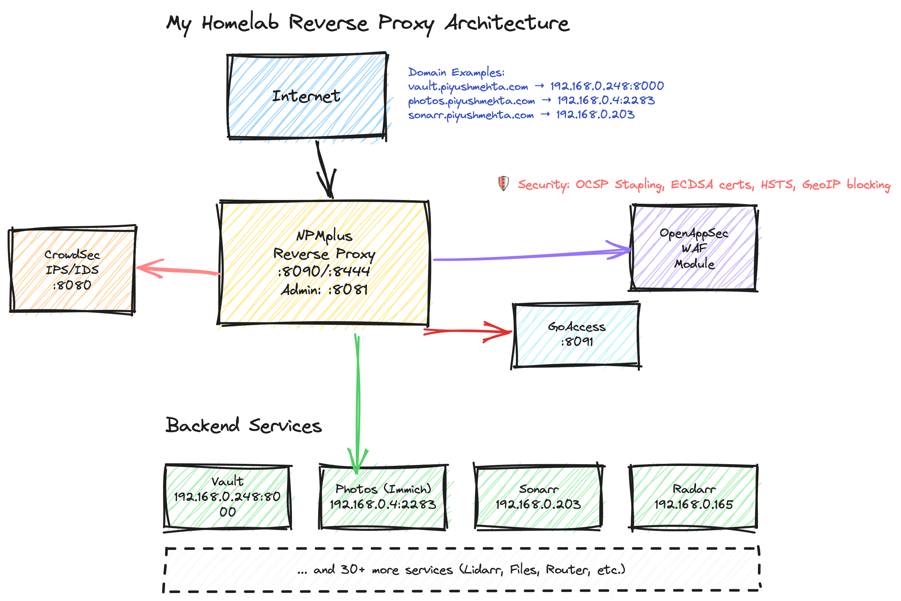

# Homelab Server Configuration

Welcome to my Homelab server! This document provides an overview of the configuration and specifications of my Intel NUC i7-1360P machine running Proxmox. Let's dive into the details!

## Hardware Specifications

- **Processor:** Intel Core i7-1360P
- **Memory:** 64GB
- **Passmark:** 19726
- **TDP:** 28 W
- **Storage:** 24TB HDD + 2TB SSD M.2 NVME
- **RAID Configuration:** RAID 1 using ZFS
- **Total Storage Capacity:** 26TB

## Software Configuration

- **Operating System:** Proxmox
- **Virtualization Platform:** Proxmox VE
- **Container Technology:** LXC (Linux Containers)
- **Virtual Machine Technology:** QEMU/KVM

## Homelab Setup

- **Purpose:** Media server, personal NAS, personal experimental Homelab
- **Network Configuration:** 2.5GBe LAN connection with [GL.Inet Flint2](https://www.gl-inet.com/products/gl-mt6000/) and Caldigit TS4 Elements Hub using 1 Thunderbolt 4 port
- **Services and Applications:** [Services](machines)

# Homelab Architecture

## Directory Structure

### `config/`

Contains configuration files for various services and applications.

### `machines/`

Contains Docker Compose configurations and related files for different services.

- **v1/**: First version of service configurations.
  - **adguard home/**: Configuration for AdGuard Home.
    - [AdGuardHome.yaml](machines/v1/adguard%20home/AdGuardHome.yaml)
  - **master/**: Configuration for master services.
    - [docker-compose.yaml](machines/v1/master/docker-compose.yaml)
  - **mediarr/**: Configuration for media-related services.
    - [docker-compose.yml](machines/v1/mediarr/docker-compose.yml)
    - [README.md](machines/v1/mediarr/README.md)
  - **misc/**: Miscellaneous service configurations.
    - [docker-compose.yml](machines/v1/misc/docker-compose.yml)
    - [README.md](machines/v1/misc/README.md)
- **v2/**: Second version of service configurations.
  - **nextcloud/**: Configuration for Nextcloud.
    - [docker-compose.yaml](machines/v2/nextcloud/docker-compose.yaml)
  - **reverse-proxy/**: Configuration for reverse proxy services.
    - [docker-compose.yaml](machines/v2/reverse-proxy/docker-compose.yaml)
  - **servarr/**: Configuration for \*arr stack services.
    - [docker-compose.yaml](machines/v2/servarr/docker-compose.yaml)

### `proxmox/`

Contains configuration files for Proxmox.

- **etc/**: Various configuration files.
  - **modules-load.d/**: Module load configurations.
    - [modules.conf](proxmox/etc/modules-load.d/modules.conf)
  - **network/**: Network configurations.
    - [interfaces](proxmox/etc/network/interfaces)
  - **pve/**: Proxmox VE configurations.
    - [.version](proxmox/etc/pve/.version)
    - [.vmlist](proxmox/etc/pve/.vmlist)
    - **lxc/**: LXC container configurations.
      - [100.conf](proxmox/etc/pve/lxc/100.conf)
    - [storage.cfg](proxmox/etc/pve/storage.cfg)
  - [filelist.txt](proxmox/filelist.txt)

## Guides and Documentations

The following guides and documentations are available for the Homelab server:

- **[Installation Guide](guides/installation.md):** A detailed guide on setting up Proxmox and configuring the Intel NUC i7-1360P for optimal performance.
- **[Network Configuration](guides/network.md):** Documentation on the network setup, including any VLANs, subnets, or firewall rules implemented.
- **[Storage Configuration](guides/storage.md):** Instructions on configuring the RAID 1 setup with ZFS, along with any additional storage-related details.
- **Services and Applications:** A list of the services and applications deployed on the Homelab server, along with their configurations.
- **[Troubleshooting](guides/storage.md):** Solutions to common issues and troubleshooting tips for the Homelab setup.
- **[Contributing](CONTRIBUTING.md):** Guidelines for contributing to the repository or suggesting improvements.

Feel free to explore the repository and contribute if you have any suggestions, ideas, or improvements!

[Link to GitHub Repository](https://github.com/piyush97/homelab)

- Huge thanks to [TTECK/Proxmox](https://github.com/tteck/Proxmox) for the inspiration and some of the scripts used in this project.

## Conclusion

Thank you for exploring my Homelab server configuration. If you have any questions or need further assistance, feel free to reach out!
